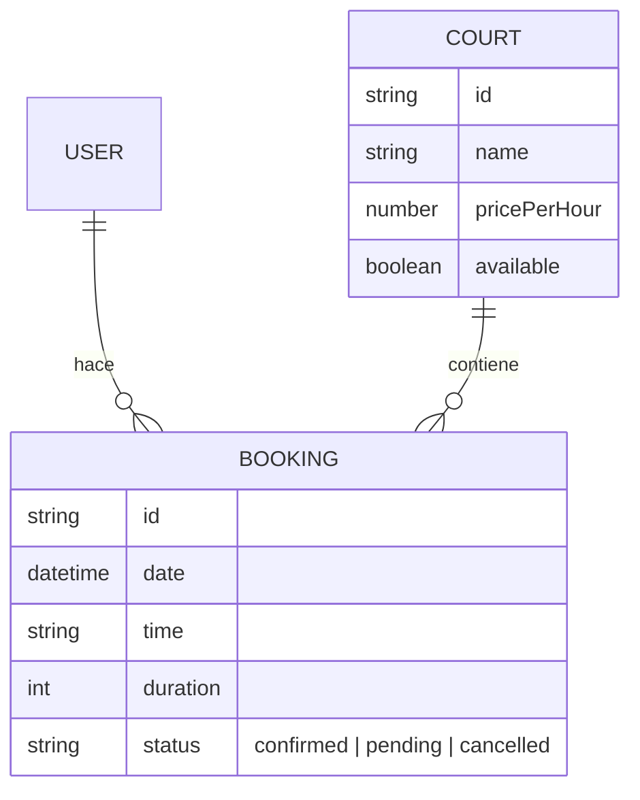

# Arquitectura de un Sistema de Booking Exitoso

Para que un sistema de reservas sea escalable y robusto, debe cubrir estas 4 capas fundamentales. Aquí tienes el "blueprint" basado en lo que armamos:

## 1. Modelo de Datos (La Base)
Necesitas 3 entidades principales relacionadas entre sí:

> [!IMPORTANT]
> **Relaciones clave:** La reserva debe guardar el `courtId` y el `userId`. Es buena práctica guardar el `price` al momento de la reserva para evitar que cambios de precios futuros afecten históricos.

---

## 2. Lógica de Disponibilidad (El Corazón)
El mayor desafío es evitar el **Double Booking** (dos personas en el mismo lugar/hora).

### El Algoritmo de Verificación:
Para cada nueva reserva, el servidor debe validar:
1.  **Día y Hora:** ¿Está dentro del horario de apertura?
2.  **Cruce de Horarios:** Buscar reservas existentes para esa `courtId` y `date` donde:
    -   `nueva_hora_inicio` < `existente_hora_fin`
    -   `nueva_hora_fin` > `existente_hora_inicio`

---

## 3. Componentes UI (La Experiencia)
Un flujo de usuario ganador se divide en:

-   **Vista de Catálogo:** Cards con fotos, tipo de superficie y precio.
-   **Selector de Horarios (Time Slots):** Una grilla interactiva que muestre claramente:
    -   🟢 **Libre** (Clickable)
    -   ⚪ **Ocupado** (Disabled)
    -   🔵 **Seleccionado** (Estado visual inmediato)
-   **Modal de Confirmación:** Resumen antes de pagar/confirmar (Cancha + Fecha + Hora + Total).

---

## 4. Estado y Persistencia (La Estabilidad)
-   **Context API / Store:** Mantener el estado global de `currentPage` y `user` para una navegación fluida (SPA).
-   **Backend Real-time:** Usar herramientas como **Supabase** o WebSockets para que, si alguien reserva mientras yo estoy viendo la página, el slot se marque como ocupado sin recargar.

---

## checklist para tu próximo proyecto:
- [ ] **Auth:** ¿Quién reserva? (Roles: Cliente vs Admin).
- [ ] **Validación Server-side:** NUNCA confíes solo en que el botón esté deshabilitado en el frontend.
- [ ] **Notificaciones:** Email o WhatsApp de confirmación.
- [ ] **Políticas de Cancelación:** Definir cuánto tiempo antes se puede cancelar.

Este esquema separa la **interfaz** de la **lógica de negocio**, permitiéndote cambiar una visual de pádel por una de consultorio médico o peluquería en minutos.
